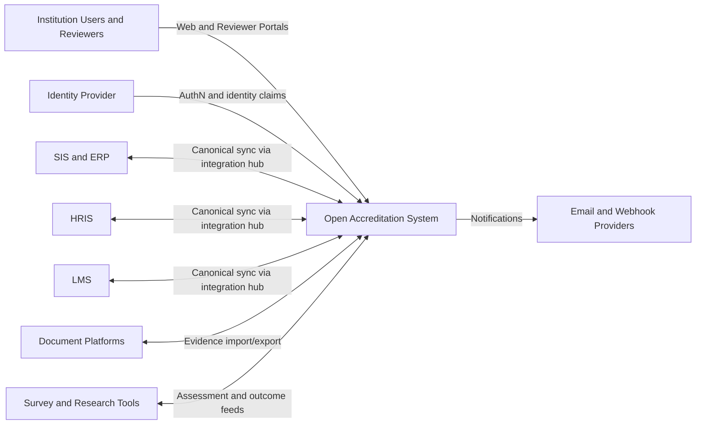

# 01 System Context

## Purpose

Open Accreditation System is a governed accreditation platform for higher education institutions. It centralizes evidence, workflows, approvals, narratives, reporting, and compliance while supporting multiple accreditors through a shared institutional model.

This repository is currently scaffold-heavy. The architecture in this document is the target operating model that future implementation prompts should follow.

## System Scope

In scope:

- institutional accreditation workflows and approvals
- evidence governance and lineage
- accreditor framework mapping and cycle management
- narrative and reporting orchestration
- integration mediation for SIS, ERP, HRIS, LMS, document platforms, and survey/research systems
- assistive AI capabilities under human review

Out of scope:

- replacing institutional systems of record (SIS, ERP, HRIS, LMS)
- unsupervised AI decision authority for approval/compliance outcomes
- accreditor-specific one-off systems that bypass the shared platform model

## Primary Actors

- accreditation administrator
- faculty contributor
- department or program reviewer
- institutional approver (committee, dean, provost delegates)
- compliance and audit reviewer
- integration operator/platform engineer

## External Systems

- identity provider (SSO, MFA, lifecycle)
- SIS and ERP systems
- HRIS systems
- LMS systems
- document repositories and storage systems
- survey and research systems
- outbound messaging providers (email, webhook endpoints)

## Context Diagram

## Trust Boundaries

- boundary 1: external users and browsers to platform APIs
- boundary 2: platform to external enterprise systems
- boundary 3: core system-of-record services to companion services
- boundary 4: operational plane for deployment, observability, and security assets

## Architectural Positioning in This Repository

- system-of-record core: `services/core-api`
- companion services: `services/integration-hub`, `services/ai-assistant`, `services/search-indexer`, `services/notification-service`
- UIs: `apps/web`, `apps/reviewer-portal`
- shared packages: `packages/*`
- contracts: `schemas/api`, `schemas/canonical`, `schemas/events`
- platform controls: `platform/security`, `platform/observability`, `platform/compliance`
- deployment plane: `deploy/docker`, `deploy/kubernetes`, `deploy/terraform`

## System Goals and Quality Priorities

- strong auditability and traceability of evidence and decisions
- explicit workflow governance with human approvals
- clear bounded contexts and module boundaries
- secure-by-default access with role and attribute constraints
- accessibility-first user experience
- adaptable accreditor support without hard-coding one framework into core domain language
