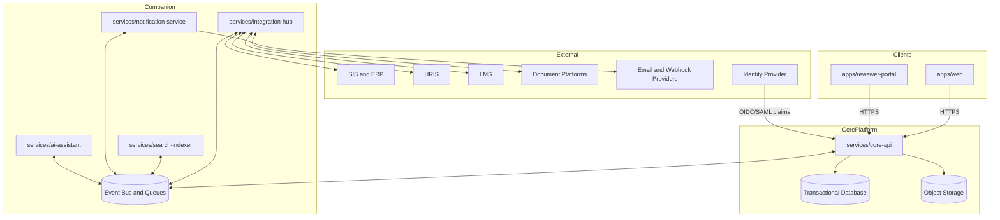

# 02 Container Diagram

## Container View (Target State)

The platform is organized as a domain-centered modular monolith (`core-api`) plus companion services for integration, AI, search, and notifications.

## Container Responsibilities

- `apps/web`: institutional portal for accreditation operations
- `apps/reviewer-portal`: reviewer and committee workflows
- `services/core-api`: system of record, modular monolith, approval and evidence authority
- `services/integration-hub`: adapter mediation, mapping, sync orchestration, retries, dead-letter handling
- `services/ai-assistant`: assistive summarization, drafting, extraction, and policy-guarded AI operations
- `services/search-indexer`: extraction and indexing projections for retrieval experiences
- `services/notification-service`: delivery orchestration across email, in-app, and webhook channels

## Primary Communication Paths

- synchronous: UI to `core-api` APIs
- synchronous/asynchronous: `core-api` to companion services through explicit APIs and event channels
- asynchronous: integration and projection workloads over queues/events
- contract governance: `schemas/api`, `schemas/canonical`, `schemas/events`

## Data Ownership Rules

- authoritative workflow/evidence/reporting state: `core-api`
- external-system translation and mapping state: `integration-hub`
- AI intermediate artifacts: `ai-assistant` (advisory only)
- search projections: `search-indexer` (derived, not authoritative)
- outbound delivery state: `notification-service`

## Current Repository Reality

Most service code is placeholder at this stage. The directory structure defines intended boundaries and should be treated as the implementation map for future prompts.
