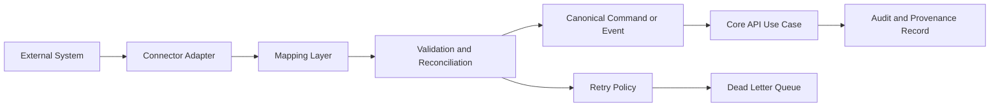

# 04 Integration Architecture

This document defines how the platform integrates with external systems while preserving a canonical internal domain model. It complements the [architecture overview](./README.md#7-integration-principles-and-consistent-handling-of-external-systems), the [bounded-context rules](./03-bounded-contexts.md#context-interaction-rules), and the [entity model reference](./data-model/README.md#entity-model-reference).

Primary integration service: `services/integration-hub`

## Table of contents

- [Purpose](#purpose)
- [Integration Tenets](#integration-tenets)
- [Integration Hub Structure](#integration-hub-structure)
- [Canonical Contracts](#canonical-contracts)
- [Data Flow Pattern](#data-flow-pattern)
- [Inbound Integration Lifecycle](#inbound-integration-lifecycle)
- [Outbound Integration Lifecycle](#outbound-integration-lifecycle)
- [Operational Controls](#operational-controls)
- [Anti-Patterns](#anti-patterns)

## Purpose

This document defines how the platform integrates with external systems while preserving a canonical internal domain model.

## Integration Tenets

- external payloads are translated at the edge
- canonical schemas are the platform contract (`schemas/canonical`)
- integration mappings are explicit, versioned, and testable
- retries and dead-letter handling are first-class operational concerns
- source-system data does not become core domain language

## Integration Hub Structure

`services/integration-hub/src` currently scaffolds these zones:

- `connectors/`:
  `erp`, `sis`, `hris`, `lms`, `document-management`, `survey-tools`, `research-systems`
- `mappings/`: source-to-canonical transforms
- `pipelines/`: ingestion and export pipelines
- `orchestration/`: scheduling and workflow coordination
- `events/`: integration lifecycle event handling
- `retries/`: retry policy implementations
- `dead-letter/`: poison-message and failure routing

## Canonical Contracts

Canonical model sources:

- `schemas/canonical/person.schema.json`
- `schemas/canonical/organization.schema.json`
- `schemas/canonical/course.schema.json`
- `schemas/canonical/program.schema.json`
- `schemas/canonical/faculty-activity.schema.json`
- `schemas/canonical/evidence-artifact.schema.json`
- `schemas/canonical/assessment-result.schema.json`
- `schemas/canonical/workflow-event.schema.json`

Event schema sources:

- `schemas/events/evidence-ingested.schema.json`
- `schemas/events/submission-approved.schema.json`
- `schemas/events/assessment-completed.schema.json`
- `schemas/events/action-plan-updated.schema.json`

Note: many schema files are placeholders now; future changes should fill them rather than bypass them.

### Internal bounded-context contract note

Not all integrations are external-system integrations. For cross-context orchestration inside `services/core-api`, use published application contracts instead of direct repository coupling. Current Phase 3 implementation uses:

- `evidence-management` -> `WorkflowEvidenceReadinessContract.evaluateWorkflowEvidenceReadiness`
- consumer: `workflow-approvals` application layer (`WorkflowApprovalsService`)

This contract keeps workflow decisions decoupled from evidence persistence internals while still enforcing evidence presence, usability, completeness, current-vs-superseded constraints, and cycle/target-scoped collection readiness constraints.

## Data Flow Pattern

## Inbound Integration Lifecycle

1. Acquire payload from source system connector.
2. Validate source envelope and connector auth context.
3. Map to canonical schema.
4. Reconcile against existing records and idempotency keys.
5. Publish canonical command/event to core platform workflow.
6. Record provenance, source identifiers, and trace metadata.
7. Route transient failures to retry channel.
8. Route terminal failures to dead-letter queue with diagnostics.

## Outbound Integration Lifecycle

1. Consume approved domain event from core.
2. Map canonical event to destination-specific payload.
3. Deliver via connector with retry semantics.
4. Persist delivery status and correlation IDs.
5. Escalate unrecoverable failures to dead-letter operations queue.

## Operational Controls

- idempotency keys for import and export operations
- deterministic mapping versions
- replay-safe event handlers
- rate limiting and backoff per destination profile
- dashboarding and alerting for failure queues and lag

## Anti-Patterns

- importing vendor payload classes into core domain models
- embedding source-specific fields in `services/core-api/src/modules/*/domain`
- direct UI to external-system coupling that bypasses integration hub
