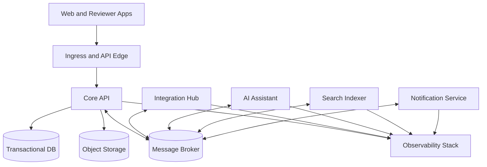

# 08 Deployment Architecture

## Purpose

This document describes the target deployment model and how repository assets map to runtime topology.

## Deployment Assets in Repository

- container builds: `deploy/docker/*.Dockerfile`
- orchestration scaffolds: `deploy/kubernetes/base`, `dev`, `test`, `prod`
- infrastructure as code: `deploy/terraform/modules`, `dev`, `test`, `prod`
- operational scripts: `deploy/scripts/bootstrap.sh`, `run-migrations.sh`, `seed-dev-data.sh`

## Environment Model

- `dev`: rapid iteration, seeded data, relaxed non-production controls
- `test`: integration and end-to-end validation
- `prod`: hardened controls, monitored SLO/SLA behavior, audited change process

## Logical Runtime Topology

## Service Deployment Units

- app container: `deploy/docker/app.Dockerfile`
- integration container: `deploy/docker/integration-hub.Dockerfile`
- AI container: `deploy/docker/ai-assistant.Dockerfile`
- search worker container: `deploy/docker/search-worker.Dockerfile`

`notification-service` should be included in deployment manifests as implementation progresses, even if current scaffold is minimal.

## Deployment Principles

- deploy core and companion services independently
- keep schema and migration rollout controlled and reversible
- enforce environment-specific config via externalized secrets/config maps
- publish health probes, metrics, and logs for all service units
- preserve backwards compatibility for event and API contracts during rolling upgrades

## Data and Storage Topology

- transactional domain state in managed database service
- evidence and exports in object storage (`storage/evidence`, `storage/exports`)
- inbound artifacts and quarantine isolation (`storage/imports`, `storage/quarantined`)
- derived search projections in search-indexer-managed index store

## Availability and Recovery Baseline

- rolling deployments with readiness/liveness checks
- retry + dead-letter strategy for asynchronous workloads
- scheduled backups for transactional and object stores
- recovery runbooks tied to `platform/observability` alerts and dashboards

## CI/CD Expectations

- build and scan all deployable containers
- run unit, integration, e2e, security, and accessibility suites per risk profile
- validate API/event/schema compatibility
- promote through `dev` -> `test` -> `prod` with environment-specific approvals

## Current-State Note

Deployment directories are scaffolded. Future prompts should implement manifests and Terraform modules in this structure rather than inventing alternate deployment paths.
