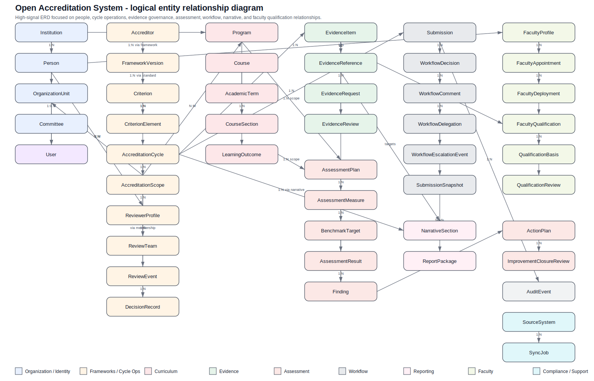

# Entity Model Reference

This document is the canonical logical data model baseline for the Open Accreditation System. It translates the architecture guardrails in [the architecture overview](../README.md#architecture-reference), [bounded contexts](../03-bounded-contexts.md#03-bounded-contexts), and [integration architecture](../04-integration-architecture.md#04-integration-architecture) into implementation-oriented entities, relationships, ownership rules, and temporal policies that future modules and AI-assisted implementation prompts should follow.

This is a **logical data model**, not a finalized physical database schema. It is intentionally:

- **domain-centered** for a modular monolith core
- **accreditor-agnostic** across AACSB, ABET, HLC, and future frameworks
- **integration-safe**, keeping source payload details outside core entities
- **AI-assistive but human-governed**, especially for evidence, workflow, narrative, and decision records

## Table of contents

- [Modeling conventions](#modeling-conventions)
  - [Identifier and type conventions](#identifier-and-type-conventions)
  - [Cross-cutting modeling rules](#cross-cutting-modeling-rules)
- [Diagram artifacts](#diagram-artifacts)
- [Coverage summary by bounded context](#coverage-summary-by-bounded-context)
- [Bounded-context entity baseline](#bounded-context-entity-baseline)
  - [`identity-access`](#identity-access)
  - [`organization-registry`](#organization-registry)
    - [`Person`](#person)
  - [`accreditation-frameworks`](#accreditation-frameworks)
    - [`CriterionElement`](#criterionelement)
    - [`EvidenceRequirement`](#evidencerequirement)
    - [`AccreditationScope`](#accreditationscope)
    - [`CycleMilestone`](#cyclemilestone)
    - [`ReviewEvent`](#reviewevent)
    - [`DecisionRecord`](#decisionrecord)
    - [`ReviewerProfile`](#reviewerprofile)
    - [`ReviewTeamMembership`](#reviewteammembership)
  - [`evidence-management`](#evidence-management)
    - [`EvidenceRequest`](#evidencerequest)
    - [`EvidenceReview`](#evidencereview)
    - [`EvidenceRetentionPolicy`](#evidenceretentionpolicy)
  - [`curriculum-mapping`](#curriculum-mapping)
    - [`AcademicTerm`](#academicterm)
    - [`CourseSection`](#coursesection)
  - [`assessment-improvement`](#assessment-improvement)
    - [`AssessmentPlan`](#assessmentplan)
    - [`AssessmentMeasure`](#assessmentmeasure)
    - [`AssessmentInstrument`](#assessmentinstrument)
    - [`BenchmarkTarget`](#benchmarktarget)
    - [`ImprovementClosureReview`](#improvementclosurereview)
  - [`workflow-approvals`](#workflow-approvals)
    - [`WorkflowComment`](#workflowcomment)
    - [`WorkflowDelegation`](#workflowdelegation)
    - [`WorkflowEscalationEvent`](#workflowescalationevent)
    - [`SubmissionSnapshot`](#submissionsnapshot)
    - [`SubmissionPackageItem`](#submissionpackageitem)
  - [`narratives-reporting`](#narratives-reporting)
  - [`faculty-intelligence`](#faculty-intelligence)
    - [`FacultyAppointment`](#facultyappointment)
    - [`FacultyDeployment`](#facultydeployment)
    - [`QualificationBasis`](#qualificationbasis)
    - [`QualificationReview`](#qualificationreview)
  - [`compliance-audit`](#compliance-audit)
  - [Supporting boundary entities](#supporting-boundary-entities)
- [Temporal Modeling and Versioning Rules](#temporal-modeling-and-versioning-rules)
  - [Core temporal policy](#core-temporal-policy)
  - [Entity-specific expectations](#entity-specific-expectations)
- [EvidenceReference contract](#evidencereference-contract)
  - [Canonical allowed `targetEntityType` values](#canonical-allowed-targetentitytype-values)
  - [Allowed `relationshipType` values](#allowed-relationshiptype-values)
  - [Validation and ownership rules](#validation-and-ownership-rules)
  - [`anchorPath` rules](#anchorpath-rules)
  - [Extension rules](#extension-rules)
- [Assessment scope matrix](#assessment-scope-matrix)
- [Reviewer/event responsibility semantics](#reviewerevent-responsibility-semantics)
- [Implementation-ready accreditation invariants (Epic 1 slice)](#implementation-ready-accreditation-invariants-epic-1-slice)
- [Implementation-ready evidence invariants (Epic 2 Phase 1 foundation)](#implementation-ready-evidence-invariants-epic-2-phase-1-foundation)
- [Implementation-ready curriculum linkage invariants (Epic 2 Phase 0 groundwork)](#implementation-ready-curriculum-linkage-invariants-epic-2-phase-0-groundwork)
- [Key cross-context relationships](#key-cross-context-relationships)
  - [Person, identity, and reviewer/faculty relationships](#person-identity-and-reviewerfaculty-relationships)
  - [Framework and accreditation engagement relationships](#framework-and-accreditation-engagement-relationships)
  - [Curriculum, assessment, and faculty relationships](#curriculum-assessment-and-faculty-relationships)
  - [Evidence, workflow, and narrative relationships](#evidence-workflow-and-narrative-relationships)
- [Modeling decisions and tradeoffs](#modeling-decisions-and-tradeoffs)
  - [Why `User` is distinct from `Person`](#why-user-is-distinct-from-person)
  - [Why accreditation cycle scope is normalized](#why-accreditation-cycle-scope-is-normalized)
  - [Why framework granularity extends below `Criterion`](#why-framework-granularity-extends-below-criterion)
  - [Why evidence uses a governed polymorphic reference](#why-evidence-uses-a-governed-polymorphic-reference)
  - [Why assessment is decomposed further](#why-assessment-is-decomposed-further)
  - [Why faculty qualification stays accreditor-agnostic](#why-faculty-qualification-stays-accreditor-agnostic)
  - [Why workflow snapshots are explicit](#why-workflow-snapshots-are-explicit)
- [Deferred / Later-Phase Entities](#deferred-later-phase-entities)

## Modeling conventions

### Identifier and type conventions

Unless a module has a stronger reason to do otherwise, prefer these platform-wide conventions:

- `uuid`: primary identifiers for governed records
- `text`: human-readable names, titles, summaries, codes, and external display identifiers
- `enum`: constrained statuses, decision types, role types, and classification values
- `boolean`: policy flags and state markers
- `date`: cycle boundaries, term dates, milestone due dates, and effective windows without time-of-day significance
- `timestamptz`: auditable event, review, approval, submission, and synchronization timestamps
- `jsonb`: controlled extension points for accreditor-specific rule metadata or integration-safe annotations
- `integer`: sequencing, ordering, version counters, retry counts, and durations
- `numeric`: measured values, percentages, scores, and benchmark thresholds when precision matters

### Cross-cutting modeling rules

- Every governed entity should include `id`, `createdAt`, and `updatedAt` unless the record is explicitly append-only and immutable after creation.
- Aggregate roots carry lifecycle state explicitly; child entities should not redefine lifecycle rules owned by the root.
- `Person` is the canonical human concept in the core model. `User` is the authenticated platform identity projection for a person who can sign in.
- Core business meaning stays in bounded contexts; source-system identifiers and raw payloads stay in the supporting integration boundary described in [Integration Tenets](../04-integration-architecture.md#integration-tenets) and [Canonical Contracts](../04-integration-architecture.md#canonical-contracts).
- Evidence records store metadata and lineage in the core model; binary content remains in object/document storage.
- AI-generated drafts, extraction results, or recommendations are advisory artifacts and never replace human review, workflow approval, or commission decisions.
- Cross-context references should point to aggregate roots or explicitly approved externally referencable children only, as defined in [03 Bounded Contexts](../03-bounded-contexts.md#ownership-matrix).

## Diagram artifacts

- Image: `docs/architecture/diagrams/open-accreditation-entity-relationship.svg`
- Structured graph exchange: `docs/architecture/diagrams/open-accreditation-entity-relationship.graphml`
- AI coding context: `docs/architecture/data-model/entities.ai-context.json`

## Coverage summary by bounded context

| Context | Aggregate roots | Primary supporting entities | Aggregate behavior summary |
| --- | --- | --- | --- |
| `identity-access` | `User`, `Role`, `ServicePrincipal` | `Permission`, `RolePermissionGrant`, `UserRoleAssignment` | `User` and `Role` are mutable roots with effective-dated assignment/grant history. |
| `organization-registry` | `Institution`, `Person`, `OrganizationUnit`, `Committee` | hierarchy/self-references only in this phase | Canonical reference roots; mutable current-state records with auditable identity/history changes. |
| `accreditation-frameworks` | `Accreditor`, `AccreditationFramework`, `FrameworkVersion`, `AccreditationCycle`, `ReviewTeam`, `ReviewerProfile` | `Standard`, `Criterion`, `CriterionElement`, `EvidenceRequirement`, `AccreditationScope`, `CycleMilestone`, `ReportingPeriod`, `ReviewEvent`, `DecisionRecord`, `ReviewTeamMembership` | Framework structure is versioned; cycle operations are mutable with append-only or supersedable event/history records. |
| `evidence-management` | `EvidenceItem`, `EvidenceCollection`, `EvidenceRequest`, `EvidenceRetentionPolicy` | `EvidenceArtifact`, `EvidenceReference`, `EvidenceReview` | Evidence metadata is mutable; artifacts/references/reviews preserve append-only lineage. |
| `curriculum-mapping` | `Program`, `Course`, `CourseSection`, `AcademicTerm`, `LearningOutcome`, `Competency` | `ProgramOutcomeMap`, `CourseOutcomeMap`, `StandardsAlignment` | Canonical academic structure is mutable current state; mappings are supersedable for traceability. |
| `assessment-improvement` | `AssessmentPlan`, `AssessmentInstrument`, `AssessmentResult`, `Finding`, `ActionPlan` | `AssessmentMeasure`, `BenchmarkTarget`, `ActionPlanTask`, `ImprovementClosureReview` | Plans/measures/targets are supersedable; results/findings/closure reviews preserve historical execution facts. |
| `workflow-approvals` | `WorkflowTemplate`, `Submission` | `WorkflowStep`, `WorkflowAssignment`, `WorkflowDecision`, `WorkflowComment`, `WorkflowDelegation`, `WorkflowEscalationEvent`, `SubmissionSnapshot`, `SubmissionPackageItem` | Runtime workflow history is append-only; snapshots/packages are immutable. |
| `narratives-reporting` | `Narrative`, `ReportPackage`, `ExportJob` | `NarrativeSection` | Draft narrative content is mutable; submitted/package-bound versions must remain reproducible. |
| `faculty-intelligence` | `FacultyProfile`, `FacultyQualification` | `FacultyAppointment`, `FacultyDeployment`, `FacultyActivity`, `QualificationBasis`, `QualificationReview` | Faculty projections are mutable current state; appointments/deployments/qualification evidence are effective-dated or append-only. |
| `compliance-audit` | `AuditEvent`, `ControlAttestation`, `PolicyException` | none in this phase | Audit events are append-only; attestations/exceptions supersede by new records. |
| supporting boundary | `SourceSystem`, `IntegrationMapping`, `SyncJob`, `Notification`, `AIArtifact` | none in this phase | Supporting service and integration records; not substitutes for core domain aggregates. |

## Bounded-context entity baseline

### `identity-access`

See also: [Architecture overview — core bounded contexts](../README.md#3-core-bounded-contexts-modules) and [bounded-context ownership rules](../03-bounded-contexts.md#identity-access).

**Purpose**

Own authentication-facing identities, role definitions, scoped assignments, and permission evaluation inputs without becoming the system of record for all people data.

**Aggregate roots**

- `User`
- `Role`
- `ServicePrincipal`

**Owned entities**

- `Permission`
- `RolePermissionGrant`
- `UserRoleAssignment`

**Aggregate notes**

- `UserRoleAssignment` is externally readable for authorization traceability but is not an independent write target.
- Assignment history should be effective-dated rather than overwritten when scope or responsibility changes.

**Entity baseline**

- `User`: authenticated platform identity with `personId`, `institutionId`, `externalSubjectId`, `email`, `status`, `lastLoginAt`, and `accessAttributes`.
- `Role`: reusable role definition with scope rules such as global, institution, organization, cycle, or review-team scope.
- `Permission`: atomic application capability such as `evidence.review` or `submission.approve`.
- `RolePermissionGrant`: explicit allow/deny membership of permissions in roles.
- `UserRoleAssignment`: time-bounded binding of a role to a user with optional scope references.
- `ServicePrincipal`: non-human identity for integration, search, AI, notification, or batch workloads.

### `organization-registry`

See also: [bounded-context ownership rules](../03-bounded-contexts.md#organization-registry).

**Purpose**

Own the tenant institution, canonical people registry, and organizational hierarchy used by access, routing, curriculum, accreditation scope, and faculty deployment.

**Aggregate roots**

- `Institution`
- `Person`
- `OrganizationUnit`
- `Committee`

**Owned entities**

- none beyond hierarchy self-reference in this phase

**Aggregate notes**

- `Person` is a canonical root because other contexts need a stable human reference even when the person never receives platform credentials.
- Committee roster management is intentionally not hidden behind prose; `CommitteeMembership` is deferred rather than ambiguous. See [Deferred / Later-Phase Entities](#deferred-later-phase-entities).

**Entity baseline**

#### `Person`

- **Purpose:** canonical institution-scoped human record used by access, reviewer, workflow, faculty, and integration reconciliation flows.
- **Key fields:** `institutionId`, `preferredName`, `legalName`, `displayName`, `primaryEmail`, `secondaryEmail`, `personStatus`, `employeeLikeIndicator`, `externalReferenceSummary`, `matchConfidenceNotes`, `effectiveStartDate`, `effectiveEndDate`.
- **Field guidance:**
  - `preferredName` is the default UX label; `legalName` is retained only where governance or document matching requires it.
  - `externalReferenceSummary` may contain normalized aliases or source correlation hints, but not raw vendor payloads.
  - `personStatus` should represent business-level status such as active, inactive, separated, retired, prospect, external-reviewer, or historical-only.
- **Lifecycle notes:** mutable current-state root; do not delete historical persons referenced by audit, workflow, reviewer, or faculty records. Soft-inactivate or effective-end instead.
- **Relationship notes:** may be projected into `User`, `ReviewerProfile`, `FacultyProfile`, workflow actor references, and committee membership later.

- `Institution`: tenant institution with lifecycle, timezone, and platform metadata.
- `OrganizationUnit`: hierarchical unit such as campus, college, school, department, or office.
- `Committee`: formal review or approval body with sponsoring unit, charter, and lifecycle state.

### `accreditation-frameworks`

See also: [bounded-context ownership rules](../03-bounded-contexts.md#accreditation-frameworks) and [integration boundary rules for canonical contracts](../04-integration-architecture.md#canonical-contracts).

**Purpose**

Own accreditor-agnostic framework structure and accreditation engagement operations: framework versions, cycle scope, reviewer teams, milestones, review events, and formal decisions.

**Aggregate roots**

- `Accreditor`
- `AccreditationFramework`
- `FrameworkVersion`
- `AccreditationCycle`
- `ReviewTeam`
- `ReviewerProfile`

**Owned entities**

- `Standard`
- `Criterion`
- `CriterionElement`
- `EvidenceRequirement`
- `AccreditationScope`
- `AccreditationScopeProgram`
- `AccreditationScopeOrganizationUnit`
- `CycleMilestone`
- `ReportingPeriod`
- `ReviewEvent`
- `DecisionRecord`
- `ReviewTeamMembership`

**Aggregate notes**

- `FrameworkVersion` is the publication boundary for standards, criteria, criterion elements, and evidence requirements. Once a version is published for institutional use, structural changes require a new version or explicit superseding child records.
- `AccreditationCycle` is the operational root for scope, milestones, reporting periods, review events, and decision history.
- `ReviewTeamMembership` is enough in v1 to express roster membership, team role, primary responsibilities, and conflict status. Event-specific assignment detail is deferred rather than implied.

**Entity baseline**

- `Accreditor`: accrediting or oversight body in an accreditor-agnostic model.
- `AccreditationFramework`: accreditor-owned or institution-imported framework family.
- `FrameworkVersion`: versioned publication of a framework with effective dates and mapping metadata.
- `Standard`: top-level standard within a framework version.
- `Criterion`: requirement grouping beneath a standard.

#### `CriterionElement`

- **Purpose:** fine-grained requirement item, indicator, sub-criterion, or expectation beneath a `Criterion` that may be directly targeted by evidence, narratives, curriculum alignments, or assessment artifacts.
- **Key fields:** `criterionId`, `code`, `title`, `statement`, `sequence`, `elementType`, `requiredFlag`, `normativeMetadata`, `effectiveStartDate`, `effectiveEndDate`, `supersedesElementId`.
- **Field guidance:**
  - `code` should preserve accreditor/source labeling when stable, but the core meaning lives in `title` and `statement`.
  - `elementType` should distinguish items such as indicator, subcriterion, component, note, or expectation without assuming one accreditor vocabulary.
  - `normativeMetadata` is the extension point for accreditor-specific hints, not a place to store raw standard documents.
- **Lifecycle notes:** belongs to `FrameworkVersion`; treat as versioned/supersedable rather than freely mutable after publication.
- **Relationship notes:** may be targeted by `EvidenceReference`, `NarrativeSection`, `StandardsAlignment`, `AssessmentPlan`, `AssessmentMeasure`, `FacultyQualification`, and `DecisionRecord` rationale.

#### `EvidenceRequirement`

- **Purpose:** framework-defined expected evidence pattern tied to a `Criterion` or `CriterionElement` without moving accreditor-specific submission payloads into the core evidence model.
- **Key fields:** `frameworkVersionId`, `criterionId`, `criterionElementId`, `requirementCode`, `title`, `description`, `requirementType`, `cardinalityRule`, `timingExpectation`, `evidenceClass`, `structuredGuidance`, `isMandatory`, `effectiveStartDate`, `effectiveEndDate`, `supersedesRequirementId`.
- **Field guidance:**
  - `criterionElementId` is preferred when the expectation is below criterion level; `criterionId` may be used when the requirement is criterion-wide.
  - `cardinalityRule` should express logic like one-per-cycle, one-per-program, or optional-supporting-set.
  - `evidenceClass` should align to internal evidence taxonomy, not vendor document classes.
  - `structuredGuidance` may hold accreditor-specific notes, examples, or validation hints in controlled JSON.
- **Lifecycle notes:** versioned with `FrameworkVersion`; supersede rather than overwrite published requirements.
- **Relationship notes:** can be referenced from `EvidenceItem`, `AccreditationScope`, `AssessmentPlan`, or workflow packaging to explain why evidence is being collected.

- `AccreditationCycle`: institutional engagement against a specific framework version.

#### `AccreditationScope`

- **Purpose:** normalized scope segment for an accreditation cycle so one cycle can cover multiple programs and organization units with distinct rationale or status.
- **Key fields:** `accreditationCycleId`, `scopeType`, `name`, `description`, `status`, `rationale`, `reviewNotes`, `effectiveStartDate`, `effectiveEndDate`, `scopeOrder`.
- **Field guidance:**
  - `scopeType` should distinguish named scope groups such as program-cluster, organizational-scope, campus-scope, institutional-scope, or exception-set.
  - `status` should capture draft, active, narrowed, withdrawn, completed, or historical.
  - `rationale` should explain why the scope segment exists, especially when it excludes otherwise related programs or units.
- **Lifecycle notes:** owned by `AccreditationCycle`; mutable while planning, then effective-dated/supersedable once officially adopted.
- **Relationship notes:** owns `AccreditationScopeProgram` and `AccreditationScopeOrganizationUnit`; may be referenced by `AssessmentPlan`, `EvidenceRequest`, `Submission`, and reviewer coordination.

- `AccreditationScopeProgram`: join entity from scope to `Program`.
- `AccreditationScopeOrganizationUnit`: join entity from scope to `OrganizationUnit`.

#### `CycleMilestone`

- **Purpose:** auditable checkpoint for major cycle events such as self-study due dates, interim reports, site visits, monitoring follow-ups, or commission decisions.
- **Key fields:** `accreditationCycleId`, `milestoneType`, `title`, `description`, `sequence`, `plannedDate`, `targetDate`, `completedDate`, `status`, `ownerPersonId`, `ownerCommitteeId`, `blockingFlag`, `supersedesMilestoneId`.
- **Field guidance:**
  - `plannedDate` captures baseline schedule; `targetDate` captures latest committed date if replanned.
  - `status` should include not-started, at-risk, on-track, completed, waived, cancelled, or superseded.
  - `blockingFlag` identifies milestones that must be satisfied before downstream workflow transitions.
- **Lifecycle notes:** effective-dated/supersedable. Preserve milestone history instead of overwriting schedule commitments.
- **Relationship notes:** may drive `WorkflowEscalationEvent`, `ReviewEvent` scheduling, evidence calls, and report package deadlines.

#### `ReportingPeriod`

- **Purpose:** explicit reporting anchor within an `AccreditationCycle` used for evidence versioning, result grouping, and report package assembly windows.
- **Key fields:** `accreditationCycleId`, `name`, `periodType`, `startDate`, `endDate`, `status`, `scopeId`.
- **Field guidance:**
  - `periodType` should remain generic: cycle-window, annual, semester, quarter, interim, or monitoring.
  - `scopeId` is optional and should be used only when a reporting window applies to a specific scope segment.
- **Lifecycle notes:** mutable while planning; close periods instead of deleting them once evidence/reporting operations reference them.
- **Relationship notes:** may be referenced by assessment artifacts, evidence records, and report package assembly logic.

#### `ReviewEvent`

- **Purpose:** operational review touchpoint such as site visit, virtual review, focused visit, interview block, or commission hearing.
- **Key fields:** `accreditationCycleId`, `reviewTeamId`, `eventType`, `title`, `status`, `modality`, `locationSummary`, `startAt`, `endAt`, `agendaSummary`, `hostOrganizationUnitId`, `notes`, `supersedesEventId`.
- **Field guidance:**
  - `reviewTeamId` points to the participating team roster for v1.
  - `modality` should remain generic: onsite, virtual, hybrid, asynchronous-review, hearing, or interview-series.
  - `agendaSummary` should remain operational metadata, not a full event-scheduling subsystem.
- **Lifecycle notes:** mutable while planning; once executed, historical fact fields should not be overwritten except by explicit correction/superseding records.
- **Relationship notes:** may have event-scoped `DecisionRecord` entries, can drive `EvidenceRequest` activity, and may be targeted by workflow submissions.

#### `DecisionRecord`

- **Purpose:** formal human-governed decision, action, condition, concern, requirement, or monitoring obligation issued for a cycle or review event.
- **Key fields:** `accreditationCycleId`, `reviewEventId`, `decisionType`, `decisionStatus`, `issuedOn`, `effectiveOn`, `decidingBodyType`, `decidingCommitteeId`, `summary`, `rationale`, `conditions`, `monitoringDueDate`, `supersedesDecisionRecordId`, `sourceReference`.
- **Field guidance:**
  - `decisionType` should be institutionally neutral: approval, reaffirmation, concern, action-required, monitoring, denial, deferment, closure, or recommendation.
  - `decidingBodyType` distinguishes internal committee, external commission, review team, administrator, or accreditor body without baking vendor names into schema.
  - `sourceReference` may store docket or letter identifiers, not raw source payloads.
- **Lifecycle notes:** append-only after issuance; changes are captured by superseding or linked corrective records.
- **Relationship notes:** may trace to `ReviewEvent`, drive workflow and milestone follow-up, influence `EvidenceRequirement` interpretation, and anchor findings or qualification reviews.

#### `ReviewerProfile`

- **Purpose:** accreditation-domain reviewer projection for expertise areas, reviewer type, conflict disclosures, and availability semantics.
- **Key fields:** `personId`, `institutionId`, `reviewerType`, `expertiseAreas`, `credentialSummary`, `affiliationSummary`, `conflictDisclosureStatus`, `conflictNotes`, `availabilityStatus`, `preferredModalities`, `activeFlag`.
- **Field guidance:**
  - `reviewerType` should distinguish external peer reviewer, chair, observer, staff liaison, internal subject-matter advisor, or commission representative.
  - `expertiseAreas` and `credentialSummary` are normalized summary fields, not CV blobs.
  - `conflictNotes` should remain summary-level and may reference governed detailed disclosures later.
- **Lifecycle notes:** mutable current-state profile with auditable disclosure changes.
- **Relationship notes:** linked to `Person`; referenced by `ReviewTeamMembership` and later by deferred assignment entities if needed.

#### `ReviewTeamMembership`

- **Purpose:** membership of people in a review team with roles, responsibility scope, conflict status, and active service window.
- **Key fields:** `reviewTeamId`, `reviewerProfileId`, `personId`, `membershipRole`, `responsibilitySummary`, `primaryContactFlag`, `conflictStatus`, `startDate`, `endDate`, `membershipStatus`, `supersedesMembershipId`.
- **Field guidance:**
  - `membershipRole` should cover chair, peer reviewer, observer, staff liaison, coordinator, note taker, or institutional liaison.
  - `responsibilitySummary` is sufficient in v1 to describe what the member is responsible for; do not invent a separate task-assignment aggregate prematurely.
  - `conflictStatus` captures governance disposition such as cleared, disclosed, recused, or pending-review.
- **Lifecycle notes:** effective-dated/supersedable. Preserve roster history for who served when.
- **Relationship notes:** owned by `ReviewTeam`; can be referenced by `ReviewEvent`, workflow records, and decisions but not mutated outside the team aggregate.

### `evidence-management`

See also: [bounded-context ownership rules](../03-bounded-contexts.md#evidence-management) and [integration anti-patterns](../04-integration-architecture.md#anti-patterns).

**Purpose**

Own governed evidence metadata, artifacts, provenance, review status, requests, retention, and controlled linkage into other contexts.

**Aggregate roots**

- `EvidenceItem`
- `EvidenceCollection`
- `EvidenceRequest`
- `EvidenceRetentionPolicy`

**Owned entities**

- `EvidenceArtifact`
- `EvidenceReference`
- `EvidenceReview`

**Aggregate notes**

- `EvidenceReference` is a governed polymorphic child of `EvidenceItem`; it is not a generic global join table.
- `EvidenceReview` is distinct from workflow approval. An evidence item may be reviewed for quality or sufficiency before, during, or after workflow submission.
- `EvidenceItem` lifecycle state is evidence-governance state, not workflow decision state.
- `EvidenceItem` and `EvidenceArtifact` are intentionally separate so governed evidence meaning is not coupled to binary/object storage implementation details.

**Entity baseline**

- `EvidenceItem`: governed evidence record with title, description, evidence type, source classification, lifecycle status, completeness/usability flags, and owning institution.
- `EvidenceArtifact`: storage-backed artifact metadata for a given evidence item, including storage bucket/key, mime metadata, and artifact-level availability state.
- `EvidenceCollection`: curated grouping of evidence items, often used for report assembly or scoped evidence calls.

#### `EvidenceRequest`

- **Purpose:** governed request for additional, revised, clarified, or replacement evidence.
- **Key fields:** `institutionId`, `requestType`, `status`, `requestedByPersonId`, `requestedToPersonId`, `requestedToCommitteeId`, `accreditationCycleId`, `reviewEventId`, `evidenceRequirementId`, `dueAt`, `responseInstructions`, `resolutionSummary`, `closedAt`.
- **Field guidance:**
  - `requestType` should distinguish new-submission, replacement, clarification, validation, retention-review, or follow-up.
  - use `requestedToCommitteeId` only when the request is to a governed body; otherwise target a `Person` or later a workflow role assignment.
  - `responseInstructions` should state governance expectations, not UI task metadata.
- **Lifecycle notes:** mutable in place while open; preserve state transitions and closure facts via events/audit.
- **Relationship notes:** may point to a resulting `EvidenceItem`, may reference `EvidenceRequirement`, and may be triggered from `ReviewEvent`, `DecisionRecord`, or workflow.

#### `EvidenceReview`

- **Purpose:** human review of evidence quality, completeness, relevance, authenticity, or retention suitability.
- **Key fields:** `evidenceItemId`, `reviewType`, `reviewStatus`, `reviewedByPersonId`, `reviewedAt`, `sufficiencyDisposition`, `authenticityDisposition`, `relevanceDisposition`, `retentionDisposition`, `comments`, `followUpRequiredFlag`, `relatedEvidenceRequestId`.
- **Field guidance:**
  - treat the disposition fields as explicit dimensions rather than one overloaded status.
  - `reviewType` should distinguish intake-validation, content-review, retention-review, qualification-review-input, or package-readiness-review.
- **Lifecycle notes:** append-only after completion; a new review records changed judgment rather than overwriting the previous one.
- **Relationship notes:** owned by `EvidenceItem`; can trigger `EvidenceRequest` or support workflow/package decisions.

#### `EvidenceRetentionPolicy`

- **Purpose:** retention and disposition rules for evidence classes, artifact types, or policy-driven record categories.
- **Key fields:** `institutionId`, `policyCode`, `name`, `appliesToEvidenceClass`, `appliesToConfidentialityLevel`, `retentionDurationMonths`, `dispositionAction`, `legalHoldCapableFlag`, `policyBasis`, `effectiveStartDate`, `effectiveEndDate`, `supersedesPolicyId`.
- **Field guidance:**
  - `policyBasis` should reference institutional or regulatory basis text, not raw policy files.
  - `dispositionAction` should support retain, archive, review-before-dispose, or dispose.
- **Lifecycle notes:** supersedable/versioned; do not retroactively reinterpret records without preserving prior policy context.
- **Relationship notes:** may be assigned directly to `EvidenceItem` or resolved by class/confidentiality rules.

- `EvidenceReference`: controlled citation/association from an evidence item to an allowed target aggregate across bounded contexts. See [EvidenceReference contract](#evidencereference-contract).

### `curriculum-mapping`

See also: [bounded-context ownership rules](../03-bounded-contexts.md#curriculum-mapping).

**Purpose**

Own canonical academic structure used by accreditation scope, standards alignment, curriculum maps, and assessment routing.

**Aggregate roots**

- `Program`
- `Course`
- `CourseSection`
- `AcademicTerm`
- `LearningOutcome`
- `Competency`

**Owned entities**

- `ProgramOutcomeMap`
- `CourseOutcomeMap`
- `StandardsAlignment`

**Aggregate notes**

- `AcademicTerm` and `CourseSection` are roots because they are shared temporal and delivery anchors across assessment, faculty, workflow, and evidence contexts.

**Entity baseline**

- `Program`: canonical academic program with award level, owning organization unit, and lifecycle status.
- `Course`: canonical catalog course.

#### `AcademicTerm`

- **Purpose:** canonical reporting and delivery period for sections, assessment windows, faculty deployments, and some scope filters.
- **Key fields:** `institutionId`, `termCode`, `name`, `termType`, `startDate`, `endDate`, `academicYearLabel`, `sequence`, `status`, `reportingWindowStart`, `reportingWindowEnd`.
- **Field guidance:**
  - `termCode` is canonical, not necessarily identical to every SIS term code.
  - `termType` should remain generic: semester, quarter, summer-session, module, annual-cycle, or special-reporting-period.
  - `reportingWindow*` fields are optional and only needed where assessment/reporting periods differ from instruction dates.
- **Lifecycle notes:** mutable root with stable IDs; changes to dates should remain audit visible because other aggregates may already reference the term.
- **Relationship notes:** referenced by `CourseSection`, `AssessmentResult`, `FacultyDeployment`, and scope/reporting filters.

#### `CourseSection`

- **Purpose:** delivered offering of a course in a term without importing SIS payload structure into the core model.
- **Key fields:** `courseId`, `academicTermId`, `sectionCode`, `deliveryMode`, `campusCode`, `organizationUnitId`, `status`, `capacity`, `instructorOfRecordPersonId`, `crossListGroupCode`, `externalReferenceSummary`.
- **Field guidance:**
  - `deliveryMode` should stay normalized: in-person, online, hybrid, practicum, lab, or independent-study.
  - `crossListGroupCode` is an optional canonical grouping helper, not a source-specific bundle ID.
  - `externalReferenceSummary` may hold source aliases or reconciliation hints.
- **Lifecycle notes:** mutable current-state root for schedule corrections, but retain historical records for any section referenced by assessment, faculty deployment, or evidence.
- **Relationship notes:** belongs to one `Course` and one `AcademicTerm`; may be targeted by `AssessmentPlan`, `AssessmentMeasure`, `FacultyDeployment`, `EvidenceReference`, and workflow packages where delivery-level evidence matters.

- `LearningOutcome`: program- or institution-level outcome used in assessment and standards alignment.
- `Competency`: competency or capability construct used for mapping beyond outcome language.
- `ProgramOutcomeMap`: relationship between programs and outcomes.
- `CourseOutcomeMap`: relationship between courses or sections and outcomes.
- `StandardsAlignment`: governed alignment between curriculum entities and framework requirements.

### `assessment-improvement`

See also: [bounded-context ownership rules](../03-bounded-contexts.md#assessment-improvement) and [AI boundary rules](../README.md#8-ai-service-boundaries).

**Purpose**

Own assessment planning, measures, instruments, benchmark targets, results, findings, action plans, and closure reviews for continuous improvement.

**Aggregate roots**

- `AssessmentPlan`
- `AssessmentInstrument`
- `AssessmentResult`
- `Finding`
- `ActionPlan`

**Owned entities**

- `AssessmentMeasure`
- `BenchmarkTarget`
- `ActionPlanTask`
- `ImprovementClosureReview`

**Aggregate notes**

- `AssessmentPlan` is the planning root; `AssessmentMeasure` and `BenchmarkTarget` should remain write-owned beneath it even if query models flatten them.
- This context must remain accreditor-agnostic; outcome, course, section, term, and program scoping are expressed canonically and later mapped to accreditor expectations.

**Entity baseline**

#### `AssessmentPlan`

- **Purpose:** governed plan defining what will be assessed, on what cadence, against which outcomes/scopes, and for what cycle or period.
- **Key fields:** `institutionId`, `planName`, `planType`, `status`, `planningHorizonType`, `accreditationCycleId`, `accreditationScopeId`, `programId`, `courseId`, `courseSectionId`, `academicTermId`, `learningOutcomeId`, `criterionElementId`, `ownerPersonId`, `ownerOrganizationUnitId`, `reviewCadence`, `effectiveStartDate`, `effectiveEndDate`, `supersedesPlanId`.
- **Field guidance:**
  - only valid combinations from the [Assessment scope matrix](#assessment-scope-matrix) should be persisted.
  - `planType` may distinguish program-assessment, course-assessment, general-education, co-curricular, institutional-effectiveness, or special-study.
  - `criterionElementId` is optional and should be used for explicit accreditation traceability, not as a substitute for learning outcome scope.
- **Lifecycle notes:** mutable while drafting; supersedable/versioned once approved or used for governed results.
- **Relationship notes:** owns `AssessmentMeasure` and associated `BenchmarkTarget` records; may reference `AccreditationScope`, `Program`, `CourseSection`, `AcademicTerm`, and `LearningOutcome` depending on scope.

#### `AssessmentMeasure`

- **Purpose:** operational measure within a plan describing method, population, execution cadence, and alignment.
- **Key fields:** `assessmentPlanId`, `measureName`, `measureType`, `status`, `populationDefinition`, `sampleStrategy`, `collectionCadence`, `measureWindowType`, `learningOutcomeId`, `courseSectionId`, `academicTermId`, `criterionElementId`, `assessmentInstrumentId`, `ownerPersonId`, `effectiveStartDate`, `effectiveEndDate`, `supersedesMeasureId`.
- **Field guidance:**
  - `measureType` should remain generic: direct, indirect, embedded-assignment, rubric-evaluation, survey, exam, portfolio, or observational.
  - `populationDefinition` should be summary logic, not a query DSL.
  - `courseSectionId` and `academicTermId` should be present only when the measure truly operates at delivery/term level.
- **Lifecycle notes:** supersedable/version-aware. Once results exist, materially changing measure design should create a successor record.
- **Relationship notes:** owned by `AssessmentPlan`; references one `AssessmentInstrument` optionally and may have one or more `BenchmarkTarget` records and many `AssessmentResult` records.

#### `AssessmentInstrument`

- **Purpose:** reusable instrument or collection method used by one or more measures.
- **Key fields:** `institutionId`, `instrumentName`, `instrumentType`, `versionLabel`, `status`, `description`, `scoringMethodSummary`, `storageReference`, `effectiveStartDate`, `effectiveEndDate`, `supersedesInstrumentId`.
- **Field guidance:**
  - `instrumentType` should remain generic: rubric, survey, exam, observation-form, portfolio-template, or external-tool.
  - `storageReference` may point to governed templates or controlled file storage, not arbitrary URLs without governance.
- **Lifecycle notes:** mutable while in design; once governed measures/results depend on it, material changes should create a successor version.
- **Relationship notes:** referenced by `AssessmentMeasure`; may also be cited as evidence through `EvidenceItem`/`EvidenceReference`.

#### `BenchmarkTarget`

- **Purpose:** explicit expected threshold, comparator, or target range against which results are interpreted.
- **Key fields:** `assessmentPlanId`, `assessmentMeasureId`, `targetType`, `metricDefinition`, `comparator`, `targetValue`, `targetRangeLow`, `targetRangeHigh`, `cohortQualifier`, `effectiveStartDate`, `effectiveEndDate`, `supersedesBenchmarkTargetId`.
- **Field guidance:**
  - allow either scalar target or range target, but not both without a clear metric interpretation.
  - `cohortQualifier` is optional and should remain summary-level for cases like entering majors, graduating seniors, or capstone sections.
- **Lifecycle notes:** supersedable/versioned; historical targets must remain visible so old findings still make sense.
- **Relationship notes:** linked to a specific `AssessmentMeasure` and interpreted by `Finding` against one or more `AssessmentResult` records.

- `AssessmentResult`: observed result set for a measure and execution period.
- `Finding`: interpretation or conclusion derived from results against benchmarks.
- `ActionPlan`: improvement response to one or more findings.
- `ActionPlanTask`: dated subtask within an action plan.

#### `ImprovementClosureReview`

- **Purpose:** formal review of whether an action plan meaningfully closed the loop.
- **Key fields:** `actionPlanId`, `reviewedByPersonId`, `reviewedAt`, `closureStatus`, `evidenceSummary`, `effectivenessJudgment`, `nextStepRecommendation`, `relatedDecisionRecordId`.
- **Field guidance:**
  - `closureStatus` should distinguish closed-effective, closed-partial, further-action-required, deferred-review, or not-closed.
  - `evidenceSummary` is a concise rationale field; full supporting documentation belongs in evidence records.
- **Lifecycle notes:** append-only after completion.
- **Relationship notes:** owned by `ActionPlan`; may cite evidence, findings, workflow snapshots, or accreditation decisions.

### `workflow-approvals`

See also: [bounded-context ownership rules](../03-bounded-contexts.md#workflow-approvals).

**Purpose**

Own governed submission workflows, assignments, decisions, comments, delegations, escalations, and immutable submission packages.

**Aggregate roots**

- `WorkflowTemplate`
- `Submission`

**Owned entities**

- `WorkflowStep`
- `WorkflowAssignment`
- `WorkflowDecision`
- `WorkflowComment`
- `WorkflowDelegation`
- `WorkflowEscalationEvent`
- `SubmissionSnapshot`
- `SubmissionPackageItem`

**Aggregate notes**

- All runtime workflow history beneath `Submission` is append-only for auditability.
- `SubmissionSnapshot` is the canonical answer to “what exactly was reviewed at that moment?”

**Entity baseline**

- `WorkflowTemplate`: reusable workflow definition for submissions.
- `WorkflowStep`: ordered step definition with routing semantics.
- `Submission`: runtime submission against a workflow and business target.
- `WorkflowAssignment`: current or historical assignment record for a step.
- `WorkflowDecision`: approval, rejection, request-change, or acknowledgement decision.

#### `WorkflowComment`

- **Purpose:** auditable comment tied to a submission, step, decision, or package review context.
- **Key fields:** `submissionId`, `workflowStepId`, `workflowDecisionId`, `authorPersonId`, `commentType`, `body`, `visibilityScope`, `pinnedFlag`, `createdAt`.
- **Field guidance:**
  - `commentType` should distinguish general-comment, reviewer-note, change-request-note, rationale, escalation-note, or internal-staff-note.
  - `visibilityScope` should remain governed: all-participants, approvers-only, internal-admin, or committee-only.
- **Lifecycle notes:** append-only; edits should be modeled as correction records or explicit edit metadata if ever allowed.
- **Relationship notes:** owned by `Submission`; can reference workflow decisions but does not replace them.

#### `WorkflowDelegation`

- **Purpose:** recorded delegation of workflow authority within allowed policy bounds.
- **Key fields:** `submissionId`, `workflowStepId`, `delegatedFromPersonId`, `delegatedToPersonId`, `delegationReason`, `scopeType`, `effectiveStartAt`, `effectiveEndAt`, `approvedByPersonId`, `status`, `revokedAt`.
- **Field guidance:**
  - `scopeType` should distinguish single-step, submission-window, temporary-absence, or emergency-delegation.
  - `approvedByPersonId` is optional when policy allows automatic delegation; otherwise required.
- **Lifecycle notes:** append-only fact plus revocation/expiration metadata; never rewrite who delegated to whom.
- **Relationship notes:** owned by `Submission`; later workflow decisions may cite a delegation record for authority.

#### `WorkflowEscalationEvent`

- **Purpose:** escalation record triggered by deadline risk, policy breach, missing action, or manual intervention.
- **Key fields:** `submissionId`, `workflowStepId`, `escalationType`, `triggeredAt`, `triggerReason`, `targetPersonId`, `targetCommitteeId`, `relatedCycleMilestoneId`, `resolutionStatus`, `resolvedAt`, `resolutionNotes`.
- **Field guidance:**
  - `escalationType` should distinguish overdue, blocked-dependency, policy-exception, quorum-risk, missing-evidence, or manual-escalation.
  - `targetCommitteeId` supports committee governance routing without requiring full committee roster modeling in v1.
- **Lifecycle notes:** append-only event with mutable resolution metadata.
- **Relationship notes:** owned by `Submission`; may be triggered by `CycleMilestone`, workflow policy, or operational review needs.

#### `SubmissionSnapshot`

- **Purpose:** immutable capture of the reviewed package at a specific submission or resubmission moment.
- **Key fields:** `submissionId`, `snapshotNumber`, `snapshotType`, `capturedAt`, `capturedByPersonId`, `hashSummary`, `summary`, `sourceDecisionId`.
- **Field guidance:**
  - `snapshotType` should distinguish initial-submit, resubmit, committee-packet, final-approved, or archival-capture.
  - `hashSummary` is optional but strongly preferred for tamper-evident export/package reconstruction.
- **Lifecycle notes:** immutable after creation.
- **Relationship notes:** owns `SubmissionPackageItem`; may be referenced by evidence, reporting, audit, and accreditation decision workflows.

#### `SubmissionPackageItem`

- **Purpose:** individual governed item included in a submission snapshot.
- **Key fields:** `submissionSnapshotId`, `itemType`, `targetEntityType`, `targetEntityId`, `displayLabel`, `itemOrder`, `requiredFlag`, `includedByPersonId`, `anchorPath`, `contentVersionSummary`.
- **Field guidance:**
  - `targetEntityType` should use the same canonical vocabulary style as `EvidenceReference`, but only for allowed submission-package contents.
  - `anchorPath` is optional and should identify sub-structure within a narrative/exported file only when needed for reproducibility.
- **Lifecycle notes:** immutable after the snapshot is created.
- **Relationship notes:** owned by `SubmissionSnapshot`; may point to evidence, narrative sections, findings, action plans, decision records, or other approved packageable content.

### `narratives-reporting`

See also: [bounded-context ownership rules](../03-bounded-contexts.md#narratives-reporting).

**Purpose**

Own narrative authoring, section structure, report assembly, and export generation while keeping narrative claims traceable to governed evidence and workflow state.

**Aggregate roots**

- `Narrative`
- `ReportPackage`
- `ExportJob`

**Owned entities**

- `NarrativeSection`

**Entity baseline**

- `Narrative`: report narrative for a cycle, self-study, interim report, or focused response.
- `NarrativeSection`: structured section with required status, owner, alignment target, and drafted/final content metadata.
- `ReportPackage`: governed package of sections and supporting artifacts for export or reviewer delivery.
- `ExportJob`: asynchronous export/rendering job for a report package.

### `faculty-intelligence`

See also: [bounded-context ownership rules](../03-bounded-contexts.md#faculty-intelligence).

**Purpose**

Own accreditation-oriented faculty profile projections, appointments, deployments, qualification basis records, qualification reviews, and related activity views without importing HRIS-specific domain language.

**Aggregate roots**

- `FacultyProfile`
- `FacultyQualification`

**Owned entities**

- `FacultyAppointment`
- `FacultyDeployment`
- `FacultyActivity`
- `QualificationBasis`
- `QualificationReview`

**Aggregate notes**

- `FacultyProfile` is a projection rooted in a canonical `Person`, not a competing people registry.
- `FacultyQualification` is the governed determination root; reasons and review history remain children beneath it.

**Entity baseline**

- `FacultyProfile`: accreditation-facing faculty record derived from canonical person and activity inputs.

#### `FacultyAppointment`

- **Purpose:** institution-facing appointment or home-unit assignment for accreditation analysis.
- **Key fields:** `facultyProfileId`, `organizationUnitId`, `appointmentType`, `rank`, `contractType`, `fullTimeEquivalent`, `primaryAppointmentFlag`, `effectiveStartDate`, `effectiveEndDate`, `status`, `sourceReferenceSummary`, `supersedesAppointmentId`.
- **Field guidance:**
  - `appointmentType` should remain generic: primary, joint, adjunct, visiting, administrative, clinical, lecturer, or temporary.
  - `sourceReferenceSummary` may contain normalized HRIS correlation data, not raw HR rows.
- **Lifecycle notes:** effective-dated/supersedable.
- **Relationship notes:** owned by `FacultyProfile`; may influence deployment sufficiency, workflow routing, and qualification interpretation.

#### `FacultyDeployment`

- **Purpose:** deployment of faculty effort into programs, sections, terms, or scope segments for accreditation sufficiency analysis.
- **Key fields:** `facultyProfileId`, `facultyAppointmentId`, `programId`, `courseSectionId`, `academicTermId`, `accreditationScopeId`, `deploymentType`, `effortPercent`, `instructionalRole`, `startDate`, `endDate`, `status`, `supersedesDeploymentId`.
- **Field guidance:**
  - use whichever target combination is actually applicable; do not require all scope references.
  - `deploymentType` should remain generic: teaching, advising, administration, supervision, assessment-support, or service.
  - `instructionalRole` is optional and should distinguish instructor-of-record, co-instructor, assessor, mentor, or supervisor when relevant.
- **Lifecycle notes:** effective-dated/supersedable. Deployment history should remain queryable for historical sufficiency analyses.
- **Relationship notes:** links faculty work to `Program`, `CourseSection`, `AcademicTerm`, or `AccreditationScope`; can be cited by evidence or qualification basis.

- `FacultyActivity`: accreditation-relevant scholarly, professional, service, or teaching activity.
- `FacultyQualification`: governed qualification classification/status record.

#### `QualificationBasis`

- **Purpose:** evidence-backed basis for a qualification determination.
- **Key fields:** `facultyQualificationId`, `basisType`, `basisSummary`, `evidenceSufficiencyStatus`, `evidenceReferenceCount`, `effectiveStartDate`, `effectiveEndDate`, `priorityOrder`, `sourceDecisionContext`, `supersedesQualificationBasisId`.
- **Field guidance:**
  - `basisType` should remain accreditor-neutral: academic-credential, professional-experience, scholarly-output, licensure, teaching-load, service-role, or institutional-judgment.
  - `sourceDecisionContext` may reference the policy or rule mapping used, not raw external calculation payloads.
- **Lifecycle notes:** append-only or supersedable depending on whether a new basis replaces an old rationale; never silently rewrite the historical basis for a qualification.
- **Relationship notes:** owned by `FacultyQualification`; should often be supported by `EvidenceReference` links.

#### `QualificationReview`

- **Purpose:** human review and approval of qualification determinations, exceptions, or renewals.
- **Key fields:** `facultyQualificationId`, `reviewType`, `reviewedByPersonId`, `reviewedAt`, `reviewStatus`, `decisionSummary`, `exceptionFlag`, `nextReviewDueDate`, `relatedDecisionRecordId`, `comments`.
- **Field guidance:**
  - `reviewType` should distinguish initial, annual, triggered-reassessment, exception-review, or appeal-review.
  - `reviewStatus` should remain simple: approved, conditionally-approved, needs-revision, denied, superseded.
- **Lifecycle notes:** append-only after completion.
- **Relationship notes:** owned by `FacultyQualification`; may align with workflow decisions, committees, and accreditation decision follow-up.

### `compliance-audit`

See also: [bounded-context ownership rules](../03-bounded-contexts.md#compliance-audit).

**Purpose**

Own auditable event records, control attestations, and policy exceptions spanning the platform without taking over business ownership from other contexts.

**Aggregate roots**

- `AuditEvent`
- `ControlAttestation`
- `PolicyException`

**Owned entities**

- none in this phase

**Entity baseline**

- `AuditEvent`: append-only auditable event referencing the originating context and entity.
- `ControlAttestation`: assertion, control owner, evidence reference, and review state.
- `PolicyException`: approved deviation with duration, rationale, and reviewer identity.

### Supporting boundary entities

These are supporting or integration-boundary records rather than core business aggregates.

- `SourceSystem`: configured source or destination system descriptor.
- `IntegrationMapping`: versioned source-to-canonical mapping definition.
- `SyncJob`: ingestion/export execution record.
- `Notification`: delivery record for a notification event.
- `AIArtifact`: advisory AI output record with provenance and review metadata.

## Temporal Modeling and Versioning Rules

### Core temporal policy

- **Mutable in place** is appropriate only for current-state reference records where historical meaning is not lost by storing changes in audit/event history, such as `User`, `Person`, `OrganizationUnit`, or `FacultyProfile`.
- **Append-only** is required for discrete review, decision, comment, audit, and package history facts where “what happened when” matters more than the current state.
- **Supersedable/versioned** is required when a record defines governed structure or policy whose historical meaning must remain understandable after later edits.
- **Effective dating** is required when a record represents a time-bounded assignment, scope, deployment, membership, policy, or scheduling commitment that may be current, future, and historical at once.
- Use **new successor records instead of overwrites** when a change would alter the interpretation of already-reviewed evidence, already-issued findings, or already-snapshotted submissions.
- Historical records should remain queryable by both business date and record creation timestamp where review/audit use cases require it.

### Entity-specific expectations

- `NarrativeSection`: mutable while drafting; once referenced by a `SubmissionSnapshot` or finalized `ReportPackage`, preserve the submitted version through snapshot/package capture or explicit section versioning rather than overwriting history.
- `AssessmentPlan`: supersedable/versioned once approved; draft edits may be in-place before governance or linked results exist.
- `AssessmentMeasure`: supersedable/versioned once any `AssessmentResult` exists or the measure is used in a governed review cycle.
- `DecisionRecord`: append-only after issuance; corrections or changed outcomes create linked successor records.
- `EvidenceRequirement`: versioned with `FrameworkVersion`; published expectations should not be overwritten in place.
- `FacultyDeployment`: effective-dated and supersedable; preserve history for past terms and sufficiency analyses.
- `FacultyQualification`: supersedable determination root; preserve the sequence of qualification states over time.
- `QualificationBasis`: append-only or explicit successor-basis pattern; never quietly rewrite the reasons for an earlier determination.
- `ReviewTeamMembership`: effective-dated; preserve roster history and conflict-state changes with successor records when the service window changes materially.
- `CycleMilestone`: effective-dated/supersedable; keep replanning history rather than replacing past commitments.
- `EvidenceReview`: append-only; new reviews record changed judgment.
- `SubmissionSnapshot`: immutable forever after creation.

## EvidenceReference contract

`EvidenceReference` is the canonical governed polymorphic link from an `EvidenceItem` to approved target records in other bounded contexts.

### Canonical allowed `targetEntityType` values

The initial canonical list is:

- `AccreditationCycle`
- `AccreditationScope`
- `Standard`
- `Criterion`
- `CriterionElement`
- `EvidenceRequirement`
- `CycleMilestone`
- `ReviewEvent`
- `DecisionRecord`
- `Program`
- `Course`
- `CourseSection`
- `AcademicTerm`
- `LearningOutcome`
- `Competency`
- `AssessmentPlan`
- `AssessmentMeasure`
- `AssessmentInstrument`
- `BenchmarkTarget`
- `AssessmentResult`
- `Finding`
- `ActionPlan`
- `ImprovementClosureReview`
- `Narrative`
- `NarrativeSection`
- `ReportPackage`
- `Submission`
- `SubmissionSnapshot`
- `SubmissionPackageItem`
- `FacultyProfile`
- `FacultyQualification`
- `FacultyDeployment`
- `QualificationBasis`
- `QualificationReview`
- `Committee`

### Allowed `relationshipType` values

Canonical `relationshipType` values in v1:

- `supports`
- `demonstrates`
- `documents`
- `measures`
- `substantiates`
- `responds-to`
- `required-by`
- `included-in`
- `derived-from`
- `supersedes`
- `context-for`

If future use cases need more values, extend by additive enumeration rather than repurposing an existing value.

### Validation and ownership rules

- The `evidence-management` context validates that `targetEntityType` is in the canonical allow-list.
- The application service that owns the target aggregate is responsible for validating that `targetEntityId` exists and is in a state that can accept evidence references.
- Cross-context validation should happen through published application interfaces, not direct persistence coupling.
- Consumers must treat unknown future `targetEntityType` values as unsupported-but-nonfatal if they were introduced after the consumer version. The canonical contract remains additive.

### `anchorPath` rules

- **Required** when the target is structurally addressable below the target root and the evidence citation must identify a specific subsection, table, row set, rubric dimension, or package item fragment. Common examples: `NarrativeSection`, `SubmissionPackageItem`, some `AssessmentInstrument` documents.
- **Optional** when the evidence supports a root or child record broadly but may also cite a subpart for convenience. Common examples: `CriterionElement`, `AssessmentMeasure`, `DecisionRecord`.
- **Forbidden** when the target has no meaningful sub-structure in the canonical model or when sub-target addressing would leak source-system internals. Common examples: `AccreditationCycle`, `AcademicTerm`, `Committee`.
- `anchorPath` must use a canonical path vocabulary defined by the target-owning context, never raw database paths or vendor payload pointers.

### Extension rules

- Add future target types only by updating this document, the AI context JSON, and the target-owning bounded-context contract together.
- New target types must preserve the same triplet contract: `targetEntityType`, `targetEntityId`, and `relationshipType`, with `anchorPath` rules defined explicitly.
- Existing consumers must not infer exhaustive switch coverage unless their version is guaranteed to match the updated allow-list.

## Assessment scope matrix

The assessment model must remain accreditor-agnostic by expressing scope through canonical academic and accreditation entities rather than accreditor-specific templates.

| Scenario | `AssessmentPlan` may target | `AssessmentMeasure` may target | Valid? | Notes |
| --- | --- | --- | --- | --- |
| Program assessment | `Program` + optional `LearningOutcome` + optional `AccreditationCycle`/`AccreditationScope` | same program, optional term/result window | Yes | Default for program-level outcome assessment. |
| Course assessment | `Course` or `CourseSection` + optional `LearningOutcome` | `CourseSection` preferred when results are section-delivered; `Course` allowed for aggregated course-level design | Yes | Keep course catalog scope distinct from delivered section execution. |
| Section/term execution | `CourseSection` + `AcademicTerm` | `CourseSection` + `AcademicTerm` | Yes | Best for embedded assessment in a specific offering. |
| Outcome library review | `LearningOutcome` only or `Program` + `LearningOutcome` | `LearningOutcome` plus optional `Program`/`CourseSection` | Yes | Useful for institution-wide or general education outcomes. |
| Accreditation traceability | any valid canonical scope above + optional `CriterionElement` | same valid scope + optional `CriterionElement` | Yes | `CriterionElement` adds traceability but does not replace academic scope. |
| Term-only plan | `AcademicTerm` only with no program/course/outcome context | `AcademicTerm` only | Usually No | Term alone is a reporting window, not usually a sufficient assessment subject. |
| Program + unrelated section | `Program` and a `CourseSection` not belonging to that program without explicit map | same | No | Requires curriculum mapping or scope rationale first. |
| Section result recorded against plan with no academic target and no outcome target | none | `CourseSection` only | No | Measures/results must inherit a valid plan scope. |

Additional rules:

- Results may be program-level, course-level, section-level, term-windowed, and/or outcome-level depending on the plan/measure scope.
- `AssessmentResult` should inherit the plan/measure scope and add execution-period specificity; it should not introduce unrelated target dimensions.
- Outcome-level assessment is valid at program, course, or section scope so long as the learning outcome alignment is explicit.
- Accreditor-specific assessment templates should map into these canonical combinations rather than creating new core entity types.

## Reviewer/event responsibility semantics

- `ReviewTeamMembership` is sufficient for v1 to represent team roster, role, service window, conflict status, and summary responsibility.
- `ReviewEvent` references the participating `ReviewTeam`; event participation is therefore inferred from active team membership unless explicitly constrained by event notes or later extensions.
- V1 does **not** introduce `ReviewEventParticipant` or `ReviewerAssignment` because current canonical needs are covered by team membership plus event references.
- Future fine-grained participation/assignment entities are expected if implementation later needs attendee-level check-in, interview-panel composition, or criterion-specific reviewer tasking. These are listed in [Deferred / Later-Phase Entities](#deferred-later-phase-entities).

## Implementation-ready accreditation invariants (Epic 1 slice)

This section is the implementation contract for the first domain slice under `services/core-api/src/modules/accreditation-frameworks`. It narrows ambiguous behavior into enforceable invariants.

Implementation note (current `core-api` slice): `AccreditationScopeProgram` and `AccreditationScopeOrganizationUnit` are persisted as explicit child records of `AccreditationScope`, `ReportingPeriod` is persisted as a first-class child of `AccreditationCycle`, decision corrections are exposed as explicit supersession operations that append a new `DecisionRecord`, and read-side retrieval is available for `FrameworkVersion`, `AccreditationCycle`, `ReviewTeam`, and `ReviewerProfile` via bounded-context application/API queries that enforce the same ownership/supersession integrity checks used by write paths.

### Aggregate ownership and mutation

| Aggregate root | Owned children | Mutable operations | Immutable/supersedable rules |
| --- | --- | --- | --- |
| `FrameworkVersion` | `Standard`, `Criterion`, `CriterionElement`, `EvidenceRequirement` | add/update while `status=draft` | after publication, structure is immutable; changes require a new framework version |
| `AccreditationCycle` | `AccreditationScope`, `CycleMilestone`, `ReportingPeriod`, `ReviewEvent`, `DecisionRecord` | scope/milestone/reporting/event planning and cycle state transitions | decisions are append-only; corrections use a new decision that supersedes the prior record |
| `ReviewTeam` | `ReviewTeamMembership` | add/supersede memberships and activate team lifecycle | membership history is append-only; superseding is explicit and a membership cannot be superseded twice |
| `ReviewerProfile` | none | create and read for reviewer identity/projection metadata | one profile per person; profile person/institution linkage is immutable |
| `AccreditationScope` (child) | `AccreditationScopeProgram`, `AccreditationScopeOrganizationUnit` | create/activate/exclude/close by cycle owner only | scope references must stay tied to the owning cycle |

### Framework/version invariants

- `AccreditationFramework` belongs to one `Accreditor`; framework-version tags are unique within a framework.
- `FrameworkVersion` publication requires at least one `Standard`, at least one `Criterion`, and at least one `CriterionElement` for every criterion.
- `Criterion` must reference a `Standard` in the same framework version.
- `CriterionElement` must reference a `Criterion` in the same framework version.
- `EvidenceRequirement` must target a valid `criterionId` or `criterionElementId` in the same framework version.
- If `EvidenceRequirement` carries both `criterionId` and `criterionElementId`, the element must belong to the same criterion.
- Aggregate rehydration from persistence must enforce the same parent/child ownership checks as command-time mutations.

### Cycle/scope/milestone/review/decision invariants

- `AccreditationCycle` must reference a **published** `FrameworkVersion`.
- `AccreditationScope` must contain at least one program or organization-unit reference; empty scopes are invalid.
- `AccreditationScope`, `CycleMilestone`, `ReportingPeriod`, and `ReviewEvent` dates must stay within `AccreditationCycle` start/end dates.
- `CycleMilestone.scopeId`, `ReportingPeriod.scopeId`, and `ReviewEvent.scopeId` must reference existing scope records in the same cycle.
- `ReviewEvent.reviewTeamId` must reference a `ReviewTeam` in the same cycle.
- `DecisionRecord` issuance is not allowed while the cycle is in `draft`.
- `DecisionRecord` corrections/supersessions must reference an existing prior decision in the same cycle, and the same decision cannot be superseded twice.
- Aggregate rehydration from persistence must reject cross-cycle child records and invalid scope/event/decision references.

### Cross-context reference rules for this slice

- `accreditation-frameworks` owns all writes to framework/cycle aggregates and children listed above.
- `organization-registry` remains the source of truth for institution and organization-unit existence; `accreditation-frameworks` stores only stable IDs.
- `curriculum-mapping` remains the source of truth for program existence; `accreditation-frameworks` stores only stable IDs.
- Existence validation for program/organization references must happen through published application ports, never by direct table-level coupling.
- Current `core-api` implementation validates institution/person/organization references through published `organization-registry` application services and validates program references through published `curriculum-mapping` application services.
- `evidence-management`, `workflow-approvals`, and `assessment-improvement` may reference IDs for traceability but must not mutate `accreditation-frameworks` state.

## Implementation-ready evidence invariants (Epic 2 Phase 1 foundation)

Implementation note (current `core-api` slice): the `evidence-management` module now includes a first-class `EvidenceItem` aggregate with `EvidenceArtifact` children and explicit classification/lifecycle semantics to establish the Phase 1 foundation.

### EvidenceItem and EvidenceArtifact invariants

- `EvidenceItem.evidenceType` is constrained to canonical values: `document`, `metric`, `narrative`, `dataset`, `assessment-artifact`.
- `EvidenceItem.sourceType` is constrained to canonical provenance values: `manual`, `upload`, `integration`.
- `EvidenceItem.status` is constrained to evidence lifecycle values: `draft`, `active`, `superseded`, `incomplete`, `archived`.
- `EvidenceItem.status` is evidence-governance state only and must not be used as workflow approval state.
- `EvidenceItem` must not embed artifact storage fields (such as bucket/key/mime/byte size); those belong to `EvidenceArtifact`.
- `EvidenceArtifact` is always owned by exactly one `EvidenceItem`.
- `EvidenceArtifact.status` is constrained to `available`, `quarantined`, or `removed`.
- `EvidenceItem.status=active` requires `isComplete=true` and at least one `EvidenceArtifact` in `available` status.
- `EvidenceItem.status=incomplete` requires `isComplete=false`.
- `EvidenceItem.status=superseded` requires `supersededByEvidenceItemId`.

## Implementation-ready curriculum linkage invariants (Epic 2 Phase 0 groundwork)

Implementation note (current `core-api` slice): to support early evidence traceability before the full `assessment-improvement` bounded-context implementation, the current curriculum module includes minimal linkage entities (`Course`, `LearningOutcome`, `CourseOutcomeMap`, `Assessment`, `AssessmentOutcomeLink`, and `AssessmentArtifact`) with strict ownership and scope invariants.

### Linkage and ownership invariants

- `Course` is institution-scoped and may optionally reference a parent `Program` and owning `OrganizationUnit`, both in the same institution.
- `LearningOutcome.scopeType` governs allowed parent references:
  - `program` requires `programId`
  - `course` requires `courseId`
  - `institution` allows neither `programId` nor `courseId`
- `CourseOutcomeMap` is unique per `(courseId, learningOutcomeId)` and both records must belong to the same institution.
- `Assessment` must reference at least one anchor (`programId` and/or `courseId`) and may optionally carry `reviewCycleId` and `reportingPeriodId` for cross-cycle reporting and future evidence versioning.
- `AssessmentOutcomeLink` is unique per `(assessmentId, learningOutcomeId)` and both records must belong to the same institution.
- `AssessmentArtifact` must reference `assessmentId` and/or `learningOutcomeId`; when both are present, they must already be linked through `AssessmentOutcomeLink`.
- `AssessmentArtifact` must carry institutional ownership scope (`scopeType`, `scopeEntityId`) where non-institution scope requires a concrete scoped entity.

## Key cross-context relationships

### Person, identity, and reviewer/faculty relationships

- `Institution 1:N Person`
- `Institution 1:N User`
- `Person 1:0..1 User`
- `Person 1:N ReviewerProfile`
- `ReviewerProfile 1:N ReviewTeamMembership`
- `Person 1:N ReviewTeamMembership`
- `Person 1:N FacultyProfile`
- `FacultyProfile 1:N FacultyAppointment`
- `FacultyProfile 1:N FacultyDeployment`
- `FacultyProfile 1:N FacultyQualification`

### Framework and accreditation engagement relationships

- `Accreditor 1:N AccreditationFramework`
- `AccreditationFramework 1:N FrameworkVersion`
- `FrameworkVersion 1:N Standard`
- `Standard 1:N Criterion`
- `Criterion 1:N CriterionElement`
- `FrameworkVersion 1:N EvidenceRequirement`
- `FrameworkVersion 1:N AccreditationCycle`
- `AccreditationCycle 1:N AccreditationScope`
- `AccreditationScope 1:N AccreditationScopeProgram`
- `AccreditationScope 1:N AccreditationScopeOrganizationUnit`
- `AccreditationCycle 1:N CycleMilestone`
- `AccreditationCycle 1:N ReportingPeriod`
- `AccreditationCycle 1:N ReviewEvent`
- `AccreditationCycle 1:N DecisionRecord`
- `AccreditationCycle 1:N ReviewTeam`
- `ReviewTeam 1:N ReviewTeamMembership`
- `ReviewEvent 1:N DecisionRecord` where event-scoped decisions are needed

### Curriculum, assessment, and faculty relationships

- `Institution 1:N Program`
- `Institution 1:N Course`
- `Program 1:N LearningOutcome`
- `Course N:M LearningOutcome` via `CourseOutcomeMap`
- `Course 1:N CourseSection`
- `AcademicTerm 1:N CourseSection`
- `Institution 1:N Assessment` (Phase 0 implementation anchor)
- `Assessment N:M LearningOutcome` via `AssessmentOutcomeLink` (Phase 0 implementation anchor)
- `Assessment 1:N AssessmentArtifact` (Phase 0 implementation anchor)
- `AssessmentPlan 1:N AssessmentMeasure`
- `AssessmentMeasure N:1 AssessmentInstrument`
- `AssessmentMeasure 1:N BenchmarkTarget`
- `AssessmentMeasure 1:N AssessmentResult`
- `AssessmentResult 1:N Finding`
- `Finding 1:N ActionPlan`
- `ActionPlan 1:N ActionPlanTask`
- `ActionPlan 1:N ImprovementClosureReview`
- `FacultyQualification 1:N QualificationBasis`
- `FacultyQualification 1:N QualificationReview`

### Evidence, workflow, and narrative relationships

- `EvidenceItem 1:N EvidenceArtifact`
- `EvidenceItem 1:N EvidenceReference`
- `EvidenceItem 1:N EvidenceReview`
- `EvidenceRetentionPolicy 1:N EvidenceItem`
- `EvidenceRequest 1:N EvidenceItem` for requested responses or revisions
- `WorkflowTemplate 1:N WorkflowStep`
- `WorkflowTemplate 1:N Submission`
- `Submission 1:N WorkflowAssignment`
- `Submission 1:N WorkflowDecision`
- `Submission 1:N WorkflowComment`
- `Submission 1:N WorkflowDelegation`
- `Submission 1:N WorkflowEscalationEvent`
- `Submission 1:N SubmissionSnapshot`
- `SubmissionSnapshot 1:N SubmissionPackageItem`
- `Narrative 1:N NarrativeSection`
- `ReportPackage 1:N ExportJob`

## Modeling decisions and tradeoffs

### Why `User` is distinct from `Person`

`Person` is the canonical human reference shared by faculty records, reviewer teams, workflow actors, and imported institutional data. `User` exists only when a person has platform credentials and authentication state. Splitting them avoids forcing external reviewers, faculty pulled from HRIS, or historical actors to become active login accounts just to preserve domain meaning.

### Why accreditation cycle scope is normalized

A single nullable `organizationUnitId` on `AccreditationCycle` does not support real accreditation engagements where one cycle may cover multiple programs across multiple colleges, departments, or campuses. `AccreditationScope` plus typed join entities normalizes that many-to-many structure, keeps the cycle root stable, and allows scope segments to carry their own rationale, status, and review notes.

### Why framework granularity extends below `Criterion`

Many accreditors define evidence expectations, narrative prompts, and assessment expectations below the criterion level. `CriterionElement` and optional `EvidenceRequirement` allow the core model to align evidence, narrative sections, assessment measures, and faculty qualification logic at the right level of granularity without hard-coding any one accreditor's terminology as universal.

### Why evidence uses a governed polymorphic reference

Evidence must cite many different target aggregates: criteria, criterion elements, narrative sections, findings, faculty qualifications, submission package items, and more. Separate join tables for every current and future target would create an explosion of tiny tables with repeated governance fields. A governed polymorphic pattern keeps the model implementation-friendly while still being safe because allowed `targetEntityType` values are explicit, validation is performed by the target-owning application service, and `relationshipType`/`anchorPath` make the citation semantics concrete.

### Why assessment is decomposed further

Real assessment practice separates planning, measure design, instruments, benchmark targets, observed results, findings, action plans, and closure review. Keeping all of that inside `AssessmentResult` would blur planning versus execution, make traceability weak, and limit reuse of measures across terms or cycles. The decomposed model preserves a clean chain from plan to measure to target to result to finding to action plan to closure review.

### Why faculty qualification stays accreditor-agnostic

The platform must support AACSB-like qualification and sufficiency analysis without assuming AACSB terminology is the universal core language. `FacultyQualification`, `QualificationBasis`, and `QualificationReview` remain accreditor-agnostic; framework-version mappings and rule metadata express accreditor-specific categories and calculations.

### Why workflow snapshots are explicit

Accreditation reviews frequently need to prove exactly what was submitted, when, by whom, and with what comments or delegated authority. `SubmissionSnapshot` and `SubmissionPackageItem` make the reviewed package immutable and auditable even as the underlying evidence or narratives continue to evolve later.

## Deferred / Later-Phase Entities

The following concepts are acknowledged but intentionally not expanded in the current logical baseline:

- `ReviewEventParticipant`: add only when event-level attendance, check-in, interview-panel composition, or partial team participation must be modeled separately from team membership.
- `ReviewerAssignment`: add only when reviewer responsibility must be expressed at criterion, narrative section, or evidence-request level beyond `ReviewTeamMembership.responsibilitySummary`.
- `CommitteeMembership`: anticipated for explicit committee roster governance because committees are first-class workflow and compliance actors, but deferred until governance operations need roster-effective-dating and quorum rules.
- student cohort and learner-segment entities for disaggregated outcomes analysis
- budget/resource request entities tied to improvement plans
- reviewer travel, reimbursement, and logistics records
- conflict-of-interest disclosure detail beyond reviewer profile flags
- rubric libraries and scoring schemas reused across assessments
- signed attestation artifacts for external commission packets
- institution-to-institution benchmarking exchanges and shared-review consortia models

These can be added later once the first implementation wave establishes the core bounded-context aggregates above.
